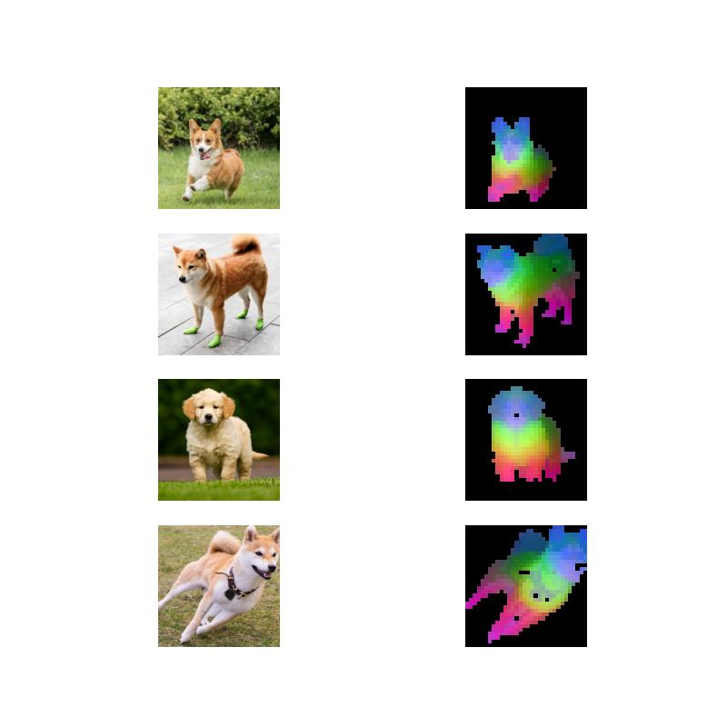

## Install
Run `source scripts/install.sh`.

## Visualization of the PCA
Run `python main.py`.

The Figure 1 of DINOv2 [paper](https://arxiv.org/pdf/2304.07193.pdf).

The results of Figure 1 are reproduced below.
### Dog

